# AI视频制作工具 - 系统设计文档

## 1. 项目概述

### 1.1 系统定位
AI视频制作工具是一款结合多模态大模型能力的智能视频创作平台，支持从故事梗概到完整视频的全流程自动化制作，采用桌面应用与云端API混合架构，为内容创作者提供专业级的AI辅助视频生产能力。

### 1.2 核心价值
- **智能化创作流程**: 从文本脚本到视频成品的端到端自动化
- **多模型协同**: 针对不同任务节点灵活配置最优AI模型
- **可视化工作台**: 提供直观的图形化流程管理和实时预览
- **模块化架构**: 支持并行处理多个视频项目，提升生产效率

### 1.3 技术选型概览

| 技术层次 | 技术栈 | 核心职责 |
|---------|--------|---------||
| 前端界面 | React + TypeScript + Ant Design + Electron | 桌面应用界面与交互 |
| 后端服务 | Python + FastAPI + Celery | API服务与异步任务调度 |
| 视频处理 | FFmpeg + OpenCV + FFmpeg.wasm | 视频合成与处理 |
| 数据存储 | PostgreSQL + 本地文件系统 | 数据持久化与本地存储 |
| AI能力 | 通义千问 + 智谱AI + 百度文心 + Stable Diffusion + 可灵AI | 文本生成、图像生成、视频生成(均通过API调用) |

## 2. 系统架构设计

### 2.1 整体架构

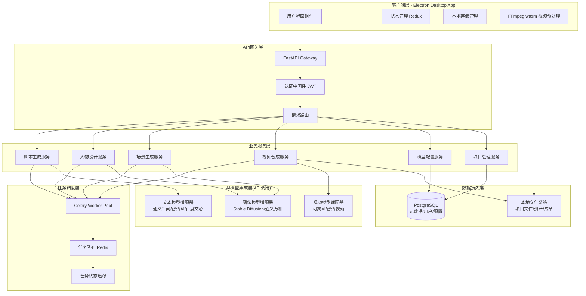

### 2.2 部署架构

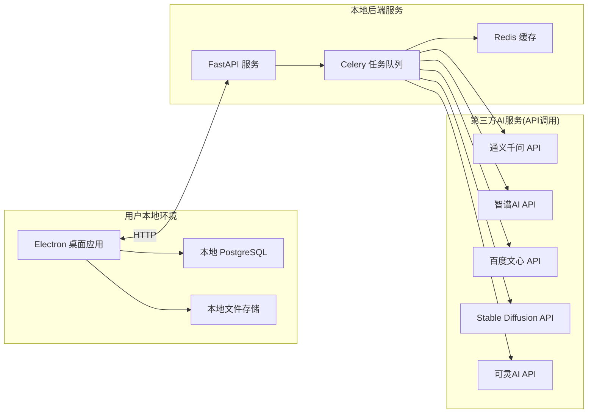

## 3. 核心业务流程设计

### 3.1 视频制作主流程

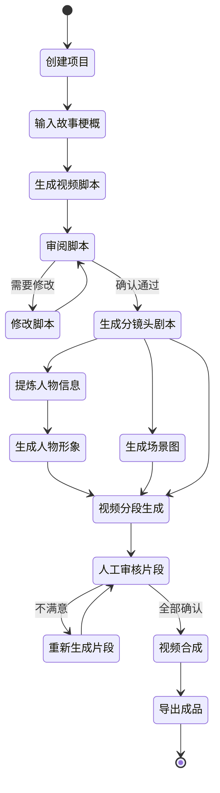

### 3.2 流程节点详细说明

| 节点名称 | 输入 | 处理逻辑 | 输出 | 可配置模型 |
|---------|------|---------|------|-----------||
| 生成视频脚本 | 故事梗概(文本) | 调用文本生成模型,根据系统提示词生成结构化脚本 | 视频脚本(包含对白、场景描述、情节) | 通义千问 / 智谱AI / 百度文心 |
| 生成分镜头剧本 | 确认后的视频脚本 | 将脚本拆解为时间序列的分镜描述 | 分镜头列表(每个镜头包含时长、内容、镜头语言) | 通义千问 / 智谱AI / 百度文心 |
| 提炼人物信息 | 视频脚本 | 分析脚本中的角色,生成人物表和小传 | 人物列表(姓名、性格、外貌特征、背景故事) | 通义千问 / 智谱AI / 百度文心 |
| 生成人物形象 | 人物小传 | 为每个人物生成多视角图像(前视图、后视图、脸部特写)和音色描述 | 人物形象图集 + 音色参数 | Stable Diffusion API / 通义万相 |
| 生成场景图 | 分镜头剧本 | 为每个场景生成多角度背景图(正面、侧面、顶视图) | 场景图集 | Stable Diffusion API / 通义万相 |
| 视频分段生成 | 人物形象 + 场景图 + 分镜描述 | 生成3-10秒的短视频片段,保持人物形象一致性 | 视频片段序列 | 可灵AI / 智谱视频生成 |
| 视频合成 | 所有视频片段 | 使用FFmpeg按时间序列拼接,添加转场效果 | 完整视频文件 | 本地处理(FFmpeg) |

### 3.3 并行任务处理机制

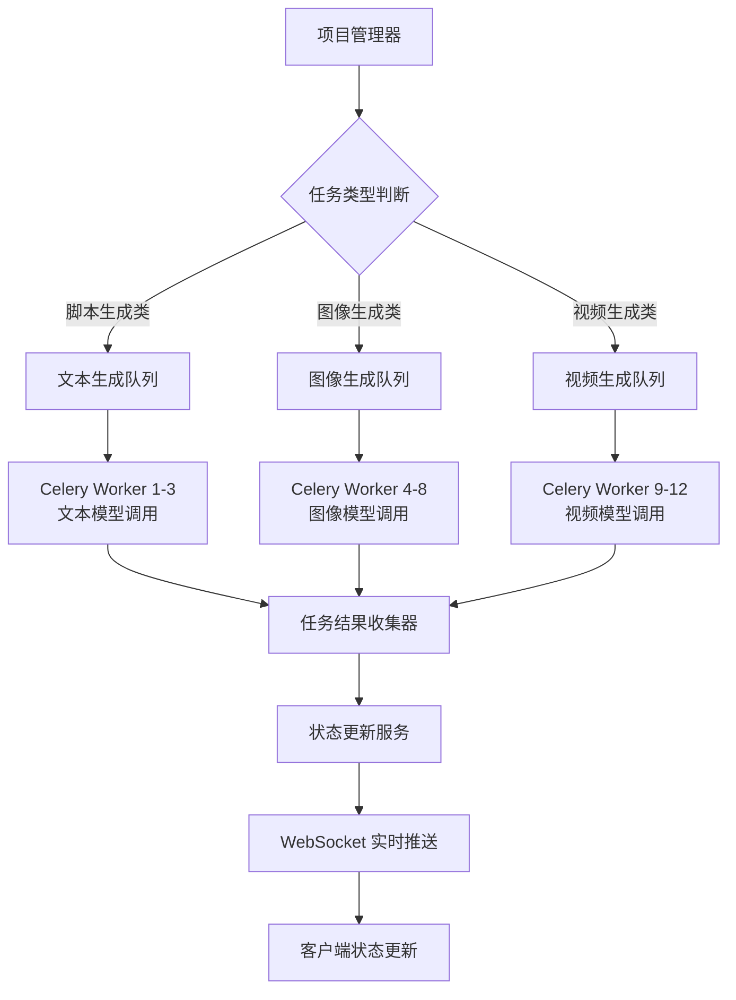

## 4. 数据模型设计

### 4.1 核心数据实体

#### 用户表 (users)
| 字段名 | 数据类型 | 说明 | 约束 |
|-------|---------|------|------|
| user_id | UUID | 用户唯一标识 | 主键 |
| username | VARCHAR(50) | 用户名 | 唯一, 非空 |
| password_hash | VARCHAR(255) | 密码哈希 | 非空 |
| email | VARCHAR(100) | 邮箱 | 唯一 |
| created_at | TIMESTAMP | 创建时间 | 默认当前时间 |
| last_login | TIMESTAMP | 最后登录时间 | 可空 |
| is_active | BOOLEAN | 账户状态 | 默认true |

#### 模型配置表 (ai_model_configs)
| 字段名 | 数据类型 | 说明 | 约束 |
|-------|---------|------|------|
| config_id | UUID | 配置唯一标识 | 主键 |
| user_id | UUID | 所属用户 | 外键 -> users |
| config_name | VARCHAR(100) | 配置名称 | 非空 |
| vendor | VARCHAR(50) | 厂商(tongyi/zhipu/baidu/keling等) | 非空 |
| model_name | VARCHAR(100) | 模型名称 | 非空 |
| api_key | VARCHAR(255) | API密钥(加密存储) | 非空 |
| api_endpoint | VARCHAR(500) | API接口地址 | 可空 |
| system_prompt | TEXT | 系统提示词 | 可空 |
| user_prompt_template | TEXT | 用户提示词模板 | 可空 |
| parameters | JSONB | 模型参数(temperature等) | 默认{} |
| created_at | TIMESTAMP | 创建时间 | 默认当前时间 |

#### 视频项目表 (video_projects)
| 字段名 | 数据类型 | 说明 | 约束 |
|-------|---------|------|------|
| project_id | UUID | 项目唯一标识 | 主键 |
| user_id | UUID | 项目所有者 | 外键 -> users |
| project_name | VARCHAR(200) | 项目名称 | 非空 |
| story_synopsis | TEXT | 故事梗概 | 可空 |
| status | VARCHAR(50) | 项目状态(draft/in_progress/completed) | 默认draft |
| workflow_graph | JSONB | 流程图数据 | 默认{} |
| created_at | TIMESTAMP | 创建时间 | 默认当前时间 |
| updated_at | TIMESTAMP | 更新时间 | 自动更新 |

#### 脚本表 (scripts)
| 字段名 | 数据类型 | 说明 | 约束 |
|-------|---------|------|------|
| script_id | UUID | 脚本唯一标识 | 主键 |
| project_id | UUID | 所属项目 | 外键 -> video_projects |
| version | INTEGER | 版本号 | 非空 |
| content | TEXT | 脚本内容 | 非空 |
| is_approved | BOOLEAN | 是否已审核通过 | 默认false |
| generated_by_config | UUID | 使用的模型配置 | 外键 -> ai_model_configs |
| created_at | TIMESTAMP | 生成时间 | 默认当前时间 |

#### 分镜表 (storyboards)
| 字段名 | 数据类型 | 说明 | 约束 |
|-------|---------|------|------|
| storyboard_id | UUID | 分镜唯一标识 | 主键 |
| script_id | UUID | 关联脚本 | 外键 -> scripts |
| shot_number | INTEGER | 镜头编号 | 非空 |
| duration | FLOAT | 时长(秒) | 非空 |
| description | TEXT | 镜头描述 | 非空 |
| camera_angle | VARCHAR(50) | 镜头角度 | 可空 |
| scene_id | UUID | 关联场景 | 外键 -> scenes |
| character_ids | JSONB | 出现的人物ID列表 | 默认[] |

#### 人物表 (characters)
| 字段名 | 数据类型 | 说明 | 约束 |
|-------|---------|------|------|
| character_id | UUID | 人物唯一标识 | 主键 |
| project_id | UUID | 所属项目 | 外键 -> video_projects |
| name | VARCHAR(100) | 人物名称 | 非空 |
| biography | TEXT | 人物小传 | 可空 |
| personality | TEXT | 性格特征 | 可空 |
| appearance | TEXT | 外貌描述 | 可空 |
| voice_profile | JSONB | 音色参数 | 默认{} |
| generated_by_config | UUID | 使用的模型配置 | 外键 -> ai_model_configs |

#### 人物形象表 (character_images)
| 字段名 | 数据类型 | 说明 | 约束 |
|-------|---------|------|------|
| image_id | UUID | 图像唯一标识 | 主键 |
| character_id | UUID | 所属人物 | 外键 -> characters |
| view_type | VARCHAR(50) | 视图类型(front/back/closeup) | 非空 |
| local_path | VARCHAR(500) | 本地存储路径 | 非空 |
| file_size | BIGINT | 文件大小(字节) | 非空 |
| generated_by_config | UUID | 使用的模型配置 | 外键 -> ai_model_configs |
| created_at | TIMESTAMP | 生成时间 | 默认当前时间 |

#### 场景表 (scenes)
| 字段名 | 数据类型 | 说明 | 约束 |
|-------|---------|------|------|
| scene_id | UUID | 场景唯一标识 | 主键 |
| project_id | UUID | 所属项目 | 外键 -> video_projects |
| name | VARCHAR(200) | 场景名称 | 非空 |
| description | TEXT | 场景描述 | 非空 |
| environment_type | VARCHAR(100) | 环境类型(室内/室外等) | 可空 |

#### 场景图表 (scene_images)
| 字段名 | 数据类型 | 说明 | 约束 |
|-------|---------|------|------|
| image_id | UUID | 图像唯一标识 | 主键 |
| scene_id | UUID | 所属场景 | 外键 -> scenes |
| angle_type | VARCHAR(50) | 视角类型(front/side/top) | 非空 |
| local_path | VARCHAR(500) | 本地存储路径 | 非空 |
| file_size | BIGINT | 文件大小(字节) | 非空 |
| generated_by_config | UUID | 使用的模型配置 | 外键 -> ai_model_configs |
| created_at | TIMESTAMP | 生成时间 | 默认当前时间 |

#### 视频片段表 (video_segments)
| 字段名 | 数据类型 | 说明 | 约束 |
|-------|---------|------|------|
| segment_id | UUID | 片段唯一标识 | 主键 |
| storyboard_id | UUID | 关联分镜 | 外键 -> storyboards |
| sequence_order | INTEGER | 序列顺序 | 非空 |
| duration | FLOAT | 实际时长(秒) | 非空 |
| local_path | VARCHAR(500) | 本地存储路径 | 非空 |
| file_size | BIGINT | 文件大小(字节) | 非空 |
| status | VARCHAR(50) | 状态(generating/completed/failed) | 默认generating |
| is_approved | BOOLEAN | 是否通过审核 | 默认false |
| generated_by_config | UUID | 使用的模型配置 | 外键 -> ai_model_configs |
| created_at | TIMESTAMP | 生成时间 | 默认当前时间 |

#### 任务表 (tasks)
| 字段名 | 数据类型 | 说明 | 约束 |
|-------|---------|------|------|
| task_id | UUID | 任务唯一标识 | 主键 |
| project_id | UUID | 所属项目 | 外键 -> video_projects |
| task_type | VARCHAR(50) | 任务类型(script/character/scene/video) | 非空 |
| celery_task_id | VARCHAR(255) | Celery任务ID | 可空 |
| status | VARCHAR(50) | 任务状态(pending/running/success/failed) | 默认pending |
| progress | INTEGER | 进度百分比(0-100) | 默认0 |
| error_message | TEXT | 错误信息 | 可空 |
| result_data | JSONB | 结果数据 | 默认{} |
| created_at | TIMESTAMP | 创建时间 | 默认当前时间 |
| completed_at | TIMESTAMP | 完成时间 | 可空 |

### 4.2 数据关系图

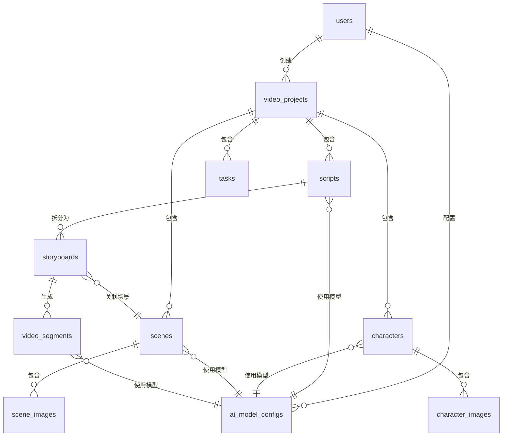

## 5. 功能模块设计

### 5.1 用户管理模块

#### 功能清单
- 用户注册(用户名、密码、邮箱验证)
- 用户登录(JWT令牌认证)
- 密码重置(邮件验证)
- 会话管理(令牌刷新、自动登出)
- 权限控制(基于角色的访问控制)

#### 认证流程

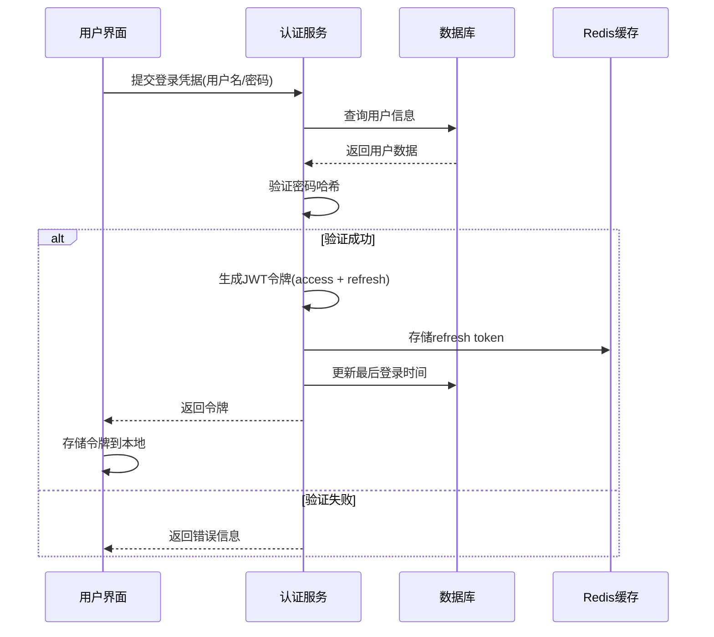

### 5.2 模型配置模块

#### 功能清单
- 添加模型厂商配置(厂商名、API Key)
- 创建模型调用配置(选择厂商、选择模型、设置提示词)
- 测试模型连接(验证API Key有效性)
- 配置参数调整(temperature、max_tokens等)
- 配置模板管理(保存常用配置为模板)

#### 配置数据结构

模型配置的parameters字段(JSONB)结构示例:

```
{
  "temperature": 0.7,
  "max_tokens": 2000,
  "top_p": 0.9,
  "frequency_penalty": 0.0,
  "presence_penalty": 0.0,
  "timeout": 60,
  "retry_times": 3
}
```

#### 模型适配器设计

```mermaid
classDiagram
    class BaseModelAdapter {
        <<abstract>>
        +config: ModelConfig
        +validate_config() bool
        +generate(prompt: str, params: dict) Response
        +handle_error(error: Exception) ErrorResponse
    }
    
    class TongyiAdapter {
        +api_endpoint: str
        +api_key: str
        +generate(prompt, params) Response
        +stream_generate(prompt, params) Iterator
    }
    
    class ZhipuAdapter {
        +api_endpoint: str
        +api_key: str
        +generate(prompt, params) Response
        +stream_generate(prompt, params) Iterator
    }
    
    class BaiduAdapter {
        +api_endpoint: str
        +api_key: str
        +access_token: str
        +generate(prompt, params) Response
        +refresh_token() str
    }
    
    class StableDiffusionAdapter {
        +api_endpoint: str
        +api_key: str
        +generate_image(prompt, params) ImageResponse
        +img2img(image, prompt) ImageResponse
    }
    
    class TongyiWanxiangAdapter {
        +api_endpoint: str
        +api_key: str
        +generate_image(prompt, params) ImageResponse
        +check_status(task_id) StatusResponse
    }
    
    class KeLingAdapter {
        +api_endpoint: str
        +api_key: str
        +generate_video(prompt, params) VideoResponse
        +check_status(task_id) StatusResponse
    }
    
    class ZhipuVideoAdapter {
        +api_endpoint: str
        +api_key: str
        +generate_video(prompt, params) VideoResponse
        +check_status(task_id) StatusResponse
    }
    
    BaseModelAdapter <|-- TongyiAdapter
    BaseModelAdapter <|-- ZhipuAdapter
    BaseModelAdapter <|-- BaiduAdapter
    BaseModelAdapter <|-- StableDiffusionAdapter
    BaseModelAdapter <|-- TongyiWanxiangAdapter
    BaseModelAdapter <|-- KeLingAdapter
    BaseModelAdapter <|-- ZhipuVideoAdapter
```

### 5.3 脚本生成模块

#### 功能清单
- 接收故事梗概输入
- 调用文本生成模型生成初版脚本
- 脚本在线编辑(富文本编辑器)
- 版本历史记录(支持回退)
- 脚本审阅标注(添加评论、批注)
- 确认脚本并触发分镜生成

#### 脚本生成提示词策略

系统提示词模板示例:
```
你是一位专业的视频脚本编剧。根据用户提供的故事梗概,生成一份结构化的视频脚本。
脚本应包含:
1. 场景描述(时间、地点、环境)
2. 人物对白(标注说话者)
3. 动作描述(镜头语言提示)
4. 情绪氛围(音乐、音效提示)

输出格式要求使用标准剧本格式,便于后续拆分为分镜头剧本。
```

### 5.4 分镜头生成模块

#### 功能清单
- 自动将脚本拆解为分镜头列表
- 分镜可视化编辑(拖拽排序、时长调整)
- 镜头参数设置(镜头类型、运动方式、景别)
- 分镜预览(文字转图像预览)
- 导出分镜表(PDF/Excel格式)

#### 分镜拆解逻辑

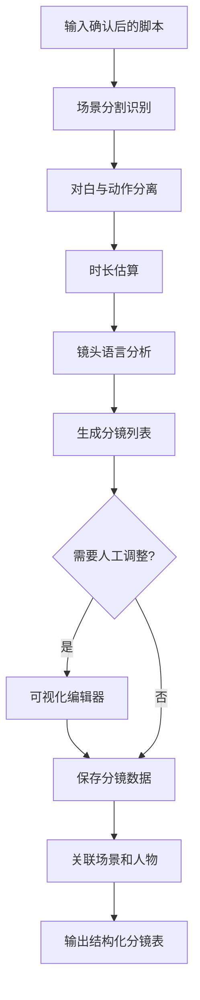

### 5.5 人物设计模块

#### 功能清单
- 从脚本自动提炼人物表
- 生成人物小传(性格、背景、关系)
- 多视角人物形象生成(前视图、后视图、特写)
- 人物一致性控制(使用相同种子或参考图)
- 音色描述生成(为后续配音准备)
- 人物库管理(跨项目复用)

#### 人物形象生成流程

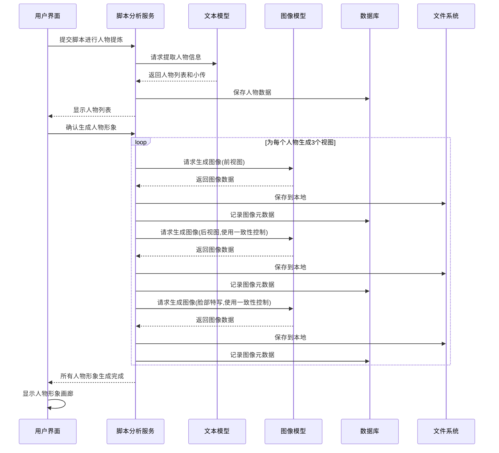

#### 人物一致性策略

| 图像模型 | 一致性控制方法 | 参数配置 |
|---------|--------------|---------||
| Stable Diffusion API | 使用种子值固定 + 参考图 | 配置种子值固定, 使用第一张图作为参考图, 调整denoising_strength |
| 通义万相 | 使用人物特征描述 + 参考图 | 在提示词中详细描述人物特征, 使用ref_img参数传入参考图 |

### 5.6 场景生成模块

#### 功能清单
- 从分镜头剧本提取场景列表
- 场景描述细化(灯光、道具、氛围)
- 多角度场景图生成(正面、侧面、顶视图)
- 场景库管理(场景复用与变体)
- 场景与分镜关联管理

#### 场景生成策略

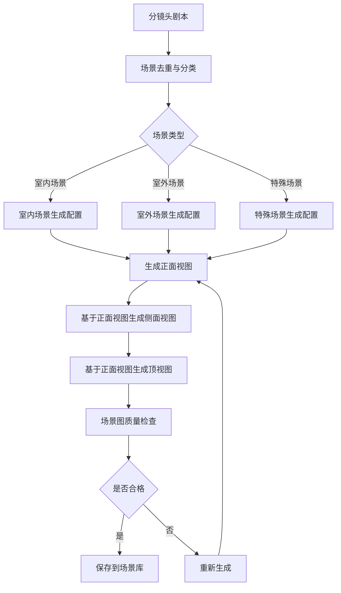

### 5.7 视频合成模块

#### 功能清单
- 按分镜顺序分段生成视频
- 视频片段质量审核(接受/拒绝/重新生成)
- 进度可视化(显示已生成片段数)
- 视频片段预览(支持单独播放)
- 自动合成完整视频(FFmpeg拼接)
- 转场效果配置(淡入淡出、切换等)
- 导出多种格式(MP4、MOV、WebM)

#### 视频分段生成流程

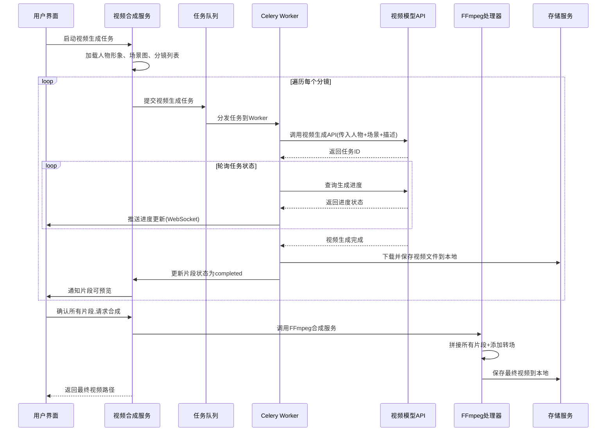

#### FFmpeg合成参数配置

| 参数类型 | 配置项 | 说明 |
|---------|-------|------|
| 视频编码 | libx264 | H.264编码,兼容性好 |
| 音频编码 | aac | AAC音频编码 |
| 分辨率 | 1920x1080 | 默认Full HD |
| 帧率 | 30fps | 标准帧率 |
| 码率 | 5000kbps | 视频质量控制 |
| 转场效果 | xfade filter | 淡入淡出、擦除等效果 |

### 5.8 项目管理模块

#### 功能清单
- 项目创建与删除
- 项目列表与搜索
- 项目状态追踪(草稿/进行中/已完成)
- 多项目并行管理
- 项目数据导出(打包下载)
- 项目协作(预留多用户协作接口)

#### 项目生命周期管理

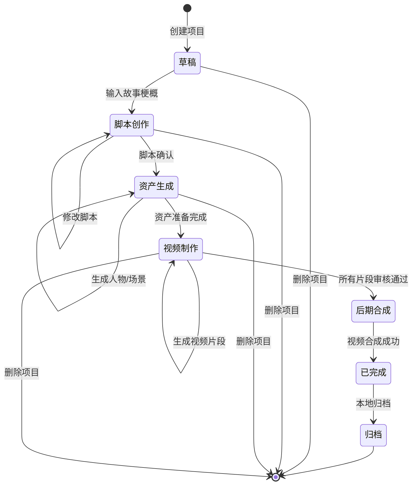

## 6. 用户界面设计

### 6.1 整体布局结构

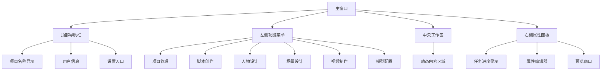

### 6.2 核心界面功能规格

#### 6.2.1 项目管理界面
- 项目卡片列表(网格或列表视图切换)
- 每个卡片显示:项目名称、封面图、状态、创建时间、进度条
- 顶部操作栏:新建项目、搜索、过滤(按状态)、排序(按时间/名称)
- 项目卡片操作:打开、重命名、删除、导出

#### 6.2.2 脚本创作界面
- 左侧:故事梗概输入区(支持Markdown)
- 中央:脚本编辑器(富文本,支持格式化)
- 右侧:版本历史列表、AI生成控制面板
- 底部操作栏:保存、生成分镜、选择模型配置

#### 6.2.3 分镜头设计界面
- 时间轴视图(横向分镜序列)
- 每个分镜卡片显示:缩略图、时长、描述摘要
- 支持拖拽调整顺序
- 点击展开详情:完整描述、镜头参数、关联场景和人物
- 右侧:分镜详情编辑面板

#### 6.2.4 人物设计界面
- 人物列表(左侧树形结构)
- 人物详情区(中央):
  - 人物基本信息(姓名、小传)
  - 形象图画廊(前视图、后视图、特写,支持点击放大)
  - 音色描述文本
- 操作按钮:生成形象、重新生成、导出人物资料

#### 6.2.5 场景设计界面
- 场景列表(左侧,按分镜分组)
- 场景详情区(中央):
  - 场景描述
  - 多角度场景图(正面、侧面、顶视图,可放大查看)
- 操作按钮:生成场景图、编辑描述、重新生成

#### 6.2.6 视频制作界面
- 流程图可视化(顶部,显示整体进度)
- 视频片段列表(左侧,时间序列排列)
- 视频预览区(中央):
  - 支持单独播放每个片段
  - 支持播放已合成的部分
  - 播放控制条(播放/暂停、进度、音量)
- 右侧:当前片段详情、生成状态、重新生成按钮
- 底部:合成完整视频按钮、导出设置、存储空间监控

#### 6.2.7 模型配置界面
- 配置列表(左侧,按厂商分组)
- 配置详情区(右侧):
  - 厂商选择下拉框
  - 模型选择下拉框
  - API Key输入框(密码格式)
  - 系统提示词编辑器
  - 用户提示词模板编辑器
  - 参数调节器(滑块或输入框)
- 操作按钮:测试连接、保存、删除、设为默认

### 6.3 交互体验设计

#### 实时反馈机制
- 所有AI生成任务显示进度条和百分比
- 使用WebSocket推送任务状态更新
- 生成完成后自动刷新界面并播放提示音
- 错误信息以Toast通知形式展示

#### 图像和视频预览
- 图像点击放大到模态框,支持缩放和平移
- 视频支持嵌入式播放器(react-player)
- 全屏播放模式(按F11或点击全屏按钮)
- 预览时显示文件尺寸、时长等元信息

#### 流程图可视化
- 使用ReactFlow或类似库绘制工作流
- 节点表示任务阶段,边表示依赖关系
- 节点状态着色:待处理(灰色)、进行中(蓝色)、已完成(绿色)、失败(红色)
- 点击节点跳转到对应功能模块

#### 科技感UI风格指南
- 配色方案:深色背景(#0a0e27) + 霓虹蓝(#00d4ff) + 紫色强调(#b833ff)
- 字体:使用等宽字体(JetBrains Mono)展示技术信息
- 动画效果:平滑过渡(300ms ease-in-out)、悬停发光效果
- 组件边框:使用渐变边框和阴影营造层次感
- 图标:使用线性图标风格(Ant Design Icons)

## 7. 存储架构设计

### 7.1 本地存储策略

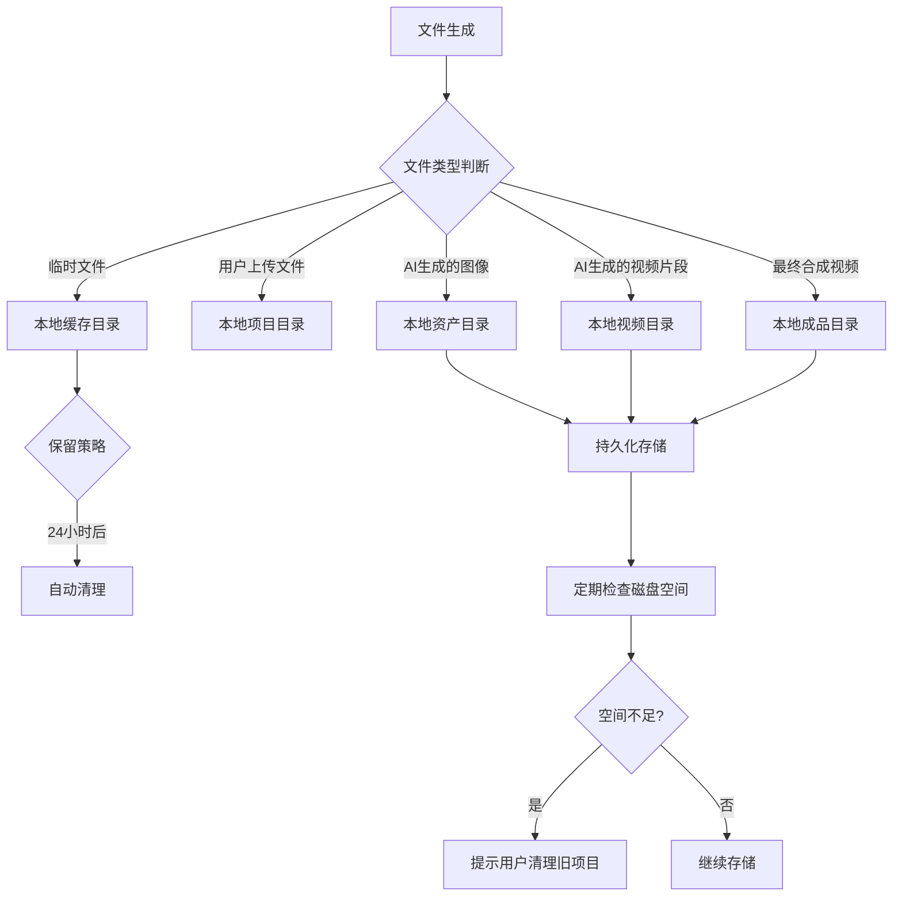

### 7.2 文件组织结构

本地存储目录规范:

```
{项目根目录}/storage/
├── users/
│   └── {user_id}/
│       └── projects/
│           └── {project_id}/
│               ├── scripts/              # 脚本文件
│               │   ├── v1.json
│               │   └── v2.json
│               ├── characters/           # 人物形象
│               │   └── {character_id}/
│               │       ├── front.png
│               │       ├── back.png
│               │       └── closeup.png
│               ├── scenes/               # 场景图
│               │   └── {scene_id}/
│               │       ├── front.png
│               │       ├── side.png
│               │       └── top.png
│               ├── segments/             # 视频片段
│               │   ├── segment_001.mp4
│               │   ├── segment_002.mp4
│               │   └── ...
│               ├── outputs/              # 最终成品
│               │   └── final_video.mp4
│               └── temp/                 # 临时文件
│                   └── (自动清理)
└── cache/                                # 全局缓存
    └── model_responses/                  # API响应缓存
```

### 7.3 数据库连接配置

PostgreSQL连接参数:
```
主机: localhost
端口: 5432
数据库名: ai_video_creator
用户名: postgres
密码: 123456
连接池大小: 20
最大溢出: 10
连接超时: 30秒
```

数据库优化策略:
- 为外键字段创建索引
- 为常用查询字段(如user_id、project_id、status)创建复合索引
- 使用JSONB字段存储灵活结构数据,并创建GIN索引
- 定期执行VACUUM和ANALYZE优化性能
- 大文本字段(如脚本内容)使用TEXT类型,必要时压缩存储

## 8. 任务调度与异步处理

### 8.1 Celery任务队列架构

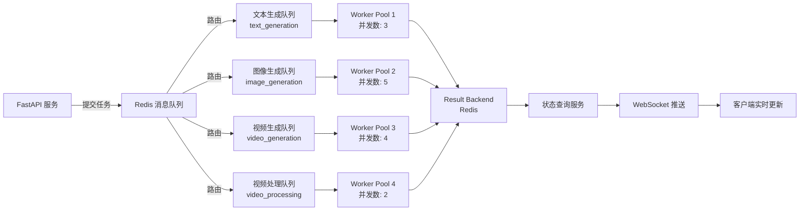

### 8.2 任务类型定义

| 任务名称 | 队列名称 | 优先级 | 超时时间 | 重试策略 |
|---------|---------|-------|---------|---------||
| generate_script | text_generation | 高 | 120秒 | 3次,指数退避 |
| generate_storyboard | text_generation | 中 | 180秒 | 3次,指数退避 |
| extract_characters | text_generation | 中 | 90秒 | 3次,指数退避 |
| generate_character_image | image_generation | 中 | 300秒 | 2次,线性退避 |
| generate_scene_image | image_generation | 中 | 300秒 | 2次,线性退避 |
| generate_video_segment | video_generation | 低 | 600秒 | 1次,无退避 |
| merge_video_segments | video_processing | 高 | 300秒 | 2次,线性退避 |

### 8.3 任务状态流转

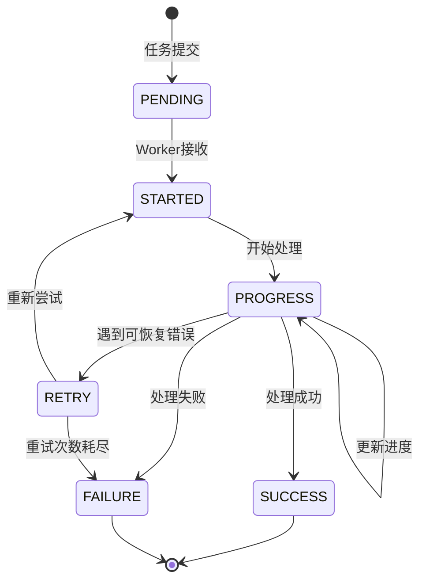

### 8.4 任务监控与恢复机制

#### 任务监控指标
- 队列长度监控(每个队列的待处理任务数)
- Worker健康检查(心跳检测)
- 任务执行时长统计(平均值、P95、P99)
- 失败率监控(按任务类型统计)

#### 异常恢复策略
- Worker崩溃:自动重启Worker进程,任务自动重新分配
- 网络超时:根据重试策略自动重试,记录错误日志
- API限流:使用指数退避策略延迟重试
- 任务堆积:动态扩展Worker数量(预留接口)

## 9. 安全性设计

### 9.1 认证与授权

#### JWT令牌机制
- Access Token:有效期15分钟,用于API请求认证
- Refresh Token:有效期7天,用于刷新Access Token
- 令牌存储:Access Token存储在内存,Refresh Token存储在HttpOnly Cookie(Web)或加密本地存储(Electron)
- 令牌刷新:Access Token过期前5分钟自动刷新

#### 权限控制矩阵

| 资源类型 | 创建 | 读取 | 更新 | 删除 |
|---------|-----|-----|-----|-----|
| 自己的项目 | ✓ | ✓ | ✓ | ✓ |
| 他人的项目 | ✗ | ✗ | ✗ | ✗ |
| 模型配置 | ✓ | ✓(仅自己的) | ✓(仅自己的) | ✓(仅自己的) |
| 系统设置 | ✗ | ✓ | ✗ | ✗ |

### 9.2 数据安全

#### 敏感信息加密
- API Key:使用AES-256加密后存储到数据库
- 用户密码:使用bcrypt哈希(工作因子12)
- 传输加密:所有API通信使用HTTPS/TLS 1.3

#### 数据访问控制
- 数据库连接:使用连接池,限制最大连接数
- SQL注入防护:使用参数化查询(SQLAlchemy ORM)
- 文件访问:验证用户ID和项目所有权,禁止路径遍历

### 9.3 API安全

#### 请求限流策略

| 端点类型 | 限流规则 | 窗口期 |
|---------|---------|-------|
| 登录接口 | 5次/IP | 15分钟 |
| 文本生成 | 20次/用户 | 1小时 |
| 图像生成 | 50次/用户 | 1天 |
| 视频生成 | 100次/用户 | 1天 |
| 文件上传 | 100次/用户 | 1小时 |

#### 输入验证
- 所有用户输入进行格式验证(Pydantic模型)
- 文件上传:限制文件类型(白名单)、文件大小(图像50MB、视频500MB)
- 文本输入:限制长度(故事梗概10000字符)
- 特殊字符过滤:防止XSS攻击

## 10. 性能优化策略

### 10.1 前端性能优化

- 代码分割:按路由懒加载组件(React.lazy)
- 图像优化:使用WebP格式,按需加载缩略图
- 虚拟滚动:长列表使用react-window
- 状态管理:使用Redux Toolkit减少不必要的重渲染
- 本地缓存:使用IndexedDB缓存项目元数据

### 10.2 后端性能优化

- 数据库查询优化:使用SELECT指定字段,避免N+1查询
- 响应缓存:常用配置数据使用Redis缓存(TTL 1小时)
- 异步处理:耗时操作全部异步化,立即返回任务ID
- 连接池:数据库和Redis使用连接池复用连接
- 响应压缩:使用gzip压缩API响应(compression middleware)

### 10.3 AI调用优化

- 批量处理:同类型任务合并批量请求(如多个人物形象)
- 结果缓存:相同提示词的结果缓存24小时
- 流式响应:支持的模型使用流式输出提升体验
- 超时控制:设置合理超时时间,避免长时间等待
- 降级策略:主模型失败时自动切换备用模型

### 10.4 存储性能优化

- 文件压缩:图像使用WebP格式,视频使用H.264编码优化文件大小
- 增量存储:仅保存必要的中间文件,其他文件可重新生成
- 磁盘监控:实时监控磁盘空间,空间不足时提示用户
- 清理策略:临时文件自动清理,失败任务的文件定期删除
- 项目打包:支持将项目打包为压缩文件便于备份和迁移

## 11. 可扩展性设计

### 11.1 模型扩展机制

新增AI模型只需:
1. 继承BaseModelAdapter实现适配器类
2. 在模型配置界面添加厂商和模型选项
3. 注册适配器到工厂类
4. 无需修改业务逻辑代码

### 11.2 功能插件化

预留插件接口用于扩展功能:
- 自定义转场效果插件
- 自定义滤镜插件
- 第三方配音服务集成
- 字幕自动生成插件

### 11.3 多语言支持

- 界面文本使用i18n国际化框架(react-i18next)
- 提示词模板支持多语言版本
- 数据库字段预留语言标识

### 11.4 云存储扩展预留

数据库设计已预留字段:
- character_images表预留cloud_url字段
- scene_images表预留cloud_url字段
- video_segments表预留cloud_url字段
- 后续可扩展云存储功能,实现本地与云端同步

## 12. 错误处理与日志

### 12.1 错误分类与处理

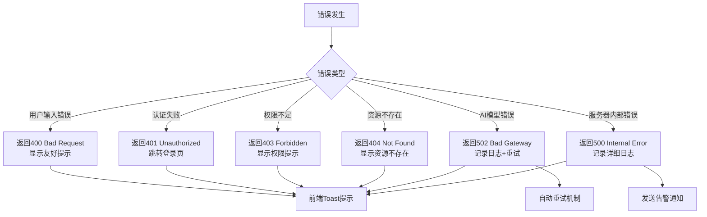

### 12.2 日志记录规范

#### 日志级别使用

| 级别 | 使用场景 | 示例 |
|-----|---------|------|
| DEBUG | 开发调试信息 | 函数参数、中间变量值 |
| INFO | 业务流程关键节点 | 用户登录、任务提交、任务完成 |
| WARNING | 可恢复的异常情况 | API限流、重试操作 |
| ERROR | 需要关注的错误 | AI调用失败、数据库异常 |
| CRITICAL | 系统级严重错误 | 服务无法启动、数据损坏 |

#### 日志格式
```
[时间戳] [级别] [模块名] [用户ID] [请求ID] - 日志消息
```

#### 日志存储策略
- 应用日志:按日期轮转,保留30天
- 错误日志:单独文件,保留90天
- 访问日志:记录所有API请求,保留7天
- 审计日志:用户关键操作,永久保留

## 13. 部署与运维

### 13.1 系统环境要求

#### 客户端环境
- 操作系统:Windows 10/11, macOS 11+, Linux(Ubuntu 20.04+)
- 内存:最低8GB,推荐16GB
- 硬盘:最低100GB可用空间
- 网络:稳定的互联网连接(上行5Mbps+)

#### 服务端环境
- Python:3.10+
- Node.js:18+ (仅用于前端构建)
- PostgreSQL:14+
- Redis:6+
- FFmpeg:5.0+

### 13.2 部署流程

#### 桌面应用打包
1. 前端构建:执行npm run build生成生产版本
2. Electron打包:使用electron-builder打包为安装程序
3. 代码签名:对安装包进行数字签名(Windows/macOS)
4. 自动更新:集成electron-updater支持自动更新

#### 后端服务部署
1. 容器化:使用Docker构建镜像
2. 数据库初始化:执行迁移脚本创建表结构
3. Worker启动:启动Celery Worker进程
4. API服务:使用Gunicorn + Uvicorn启动FastAPI
5. 反向代理:使用Nginx作为反向代理和负载均衡

### 13.3 监控与告警

#### 监控指标
- 系统指标:CPU、内存、磁盘、网络
- 应用指标:请求QPS、响应时间、错误率
- 业务指标:活跃用户数、视频生成成功率、任务队列长度
- 资源指标:数据库连接数、Redis内存使用、文件存储空间

#### 告警规则
- API错误率 > 5%:发送告警
- 任务队列堆积 > 100:发送告警
- 磁盘空间 < 10%:发送告警
- 数据库响应时间 > 1s:发送告警

## 14. 技术风险与应对

### 14.1 风险识别

| 风险类型 | 风险描述 | 影响程度 | 应对措施 |
|---------|---------|---------|---------||
| AI模型稳定性 | 第三方API服务不稳定或限流 | 高 | 多模型备份,实现自动切换机制 |
| 视频生成质量 | AI生成视频质量不可控 | 中 | 提供人工审核和重新生成功能 |
| 成本控制 | AI调用成本过高 | 中 | 实现用量统计和配额限制 |
| 数据安全 | 用户数据和API密钥泄露风险 | 高 | 加密存储,权限隔离,定期审计 |
| 并发性能 | 高并发下系统性能下降 | 中 | 任务队列削峰,限流保护 |
| 存储空间 | 视频文件占用大量本地存储 | 高 | 磁盘监控,定期清理,提示用户删除旧项目 |

### 14.2 降级策略

#### 服务降级优先级
1. 低优先级:视频自动合成(改为手动触发)
2. 中优先级:场景图多角度生成(只生成正面视图)
3. 高优先级:保留核心脚本生成和人物生成功能

#### 熔断机制
- AI调用失败率 > 50%(1分钟内):熔断5分钟,提示用户检查网络或API配置
- 数据库连接失败:切换到只读模式
- 本地磁盘空间 < 5GB:禁止新建项目和生成任务,强制提示用户清理

## 15. 测试策略

### 15.1 测试范围

| 测试类型 | 覆盖范围 | 工具 |
|---------|---------|------|
| 单元测试 | 业务逻辑函数、工具函数 | Pytest |
| 集成测试 | API接口、数据库操作 | Pytest + TestClient |
| 端到端测试 | 完整业务流程 | Playwright |
| 性能测试 | API响应时间、并发能力 | Locust |
| 安全测试 | SQL注入、XSS、权限绕过 | OWASP ZAP |

### 15.2 关键测试场景

1. 用户注册登录流程
2. 从梗概到脚本的完整生成
3. 人物形象一致性验证
4. 视频片段生成和合成
5. 多项目并行处理
6. 异常情况下的任务恢复
7. 文件上传和云存储同步
8. 权限隔离验证

## 16. 项目实施建议

### 16.1 开发阶段划分

#### 第一阶段:基础框架(4周)
- 搭建前后端项目骨架
- 实现用户认证系统
- 完成数据库设计和迁移
- 集成第一个AI模型(OpenAI文本)

#### 第二阶段:核心功能(6周)
- 实现脚本生成和编辑功能
- 实现分镜头生成功能
- 集成图像生成模型
- 完成人物和场景设计模块

#### 第三阶段:视频制作(6周)
- 集成视频生成模型
- 实现视频片段生成和管理
- 开发FFmpeg视频合成功能
- 实现任务队列和进度追踪

#### 第四阶段:完善优化(4周)
- 完成模型配置管理
- 实现云存储集成
- 性能优化和压力测试
- UI/UX优化和bug修复

### 16.2 关键技术验证

在正式开发前需验证:
1. 视频生成模型的人物一致性能力
2. FFmpeg视频合成的转场效果质量
3. Electron应用的视频播放性能
4. 大文件上传的稳定性
5. 分布式任务队列的可靠性

### 16.3 迭代优化方向

后续版本可考虑:
- 支持语音合成和配音
- 支持自动字幕生成
- 支持视频剪辑和特效
- 支持团队协作功能
- 支持模板市场
- 支持移动端应用- 支持模板市场
